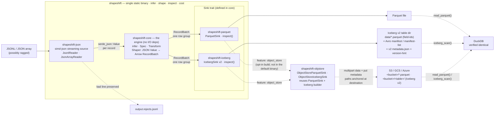

# shapeshift

**shapeshift** streams JSON/JSONL into **Parquet** or an **Apache Iceberg v2** table under a small
declarative *dataset transform spec*. Write one spec per source *shape* — the columns, types, and
value transforms your rows need — then shape unbounded rows on your own hardware for the cost of the
CPU that does it. It is a single static **Apache-2.0** Rust binary (or an embeddable set of crates):
no JVM, no catalog server, no Python, no row cap, no telemetry. It is the honest answer to per-row
(MAR) billing — the shaping **data-plane**, and nothing else.

## The gap

Managed ELT — Fivetran and its peers — bills by **MAR (Monthly Active Rows)**: every distinct
primary key inserted, updated, or deleted in a month, priced on a steep tiered curve. Re-touching the
same rows pays again. Fanning one source into several datasets pays again. The bill tracks *row
activity*, not the compute that moved the bytes, so a chatty upstream can dwarf the actual work.

Meanwhile the **Iceberg-Rust write path is now production-ready**, so a single static Rust binary can
land governed lakehouse tables — Parquet data files, Avro manifests, JSON table metadata — with no JVM
and no catalog server in the loop. shapeshift shapes the same rows a managed connector would bill you
for, at CPU cost, and writes them straight into the columnar/lakehouse formats your query engine
already reads. You keep the data locality; you keep the money.

## Quickstart

A real, copy-pasteable session against the shipped [`examples/events.jsonl`](./examples/events.jsonl)
(four good records — one line is deliberately not JSON):

```sh
# 1. Infer a spec from a sample and print a ready-to-edit YAML DatasetSpec.
$ shapeshift infer -i examples/events.jsonl
dataset: events
source:
  format: jsonl
  path: examples/events.jsonl
output:
  format: parquet
  path: events.parquet
  compression: snappy
schema: infer
columns:
- name: active
  type: bool
  required: false
- name: amount
  type: float64
  required: false
- name: day
  type: date          # YYYY-MM-DD detected → DATE
  required: false
- name: event_at
  type: timestamp     # RFC3339 detected → TIMESTAMP(µs)
  required: false
- name: id
  type: int64
  required: false
- name: tags
  type: json          # arrays become a JSON-encoded string leaf
  required: false
- name: user.name     # nested objects flatten to dotted columns
  type: string
  required: false
- name: user.plan
  type: string
  required: false
options:
  flatten: true
  row_group_rows: 50000
  infer_sample: 1000
```

```sh
# 2. Shape it. With no --spec, shapeshift infers on the fly (so --input and --output are required).
$ shapeshift shape --input examples/events.jsonl --output events.parquet
shaped `events` → events.parquet (Parquet)
rows_in=4 rows_out=4 rejected=0 parse_errors=1 row_groups=1 bytes=2588
malformed / rejected rows → events.parquet.rejects.jsonl (1 parse, 0 shaped-out)
```

The run never aborts on a bad line. The one non-JSON line was **counted** (`parse_errors=1`) and its
raw text was **sidecarred** to `events.parquet.rejects.jsonl`, one JSON object per line
(`line` / `error` / `raw`):

```json
{"error":"ExpectedNull at character 0 ('n')","line":4,"raw":"not-json-a-bad-line"}
```

```sh
# 3. Inspect the Parquet file (footer only — no data scan).
$ shapeshift inspect events.parquet
parquet file: events.parquet
  rows: 4
  row-groups: 1
  columns (8):
    active: Boolean
    amount: Float64
    day: Date32
    event_at: Timestamp(Microsecond, None)
    id: Int64
    tags: Utf8
    user.name: Utf8
    user.plan: Utf8
```

```sh
# 4. Same input, same spec, but land an Apache Iceberg v2 table directory instead.
$ shapeshift shape --input examples/events.jsonl --output events_tbl --to iceberg
shaped `events` → events_tbl (Iceberg)
rows_in=4 rows_out=4 rejected=0 parse_errors=1 row_groups=1 bytes=3212
malformed / rejected rows → events_tbl.rejects.jsonl (1 parse, 0 shaped-out)
iceberg table metadata → events_tbl/metadata/v1.metadata.json

$ shapeshift inspect events_tbl
iceberg table: events_tbl
  format-version: 2
  table-uuid: 863152cb-5515-4e65-ae68-233cf2449571
  current-snapshot-id: 2060351657693168789
  total-records: 4
  columns (8):
    active: boolean
    amount: double
    day: date
    event_at: timestamp
    id: long
    tags: string
    user.name: string
    user.plan: string
```

The table is self-contained — no catalog server needed:

```text
events_tbl/
  data/<uuid>.parquet                          # data, carrying PARQUET:field_id 1..N
  metadata/<uuid>-m0.avro                       # manifest (field-id-carrying Avro schema)
  metadata/snap-<snapshot-id>-1-<uuid>.avro     # manifest list
  metadata/v1.metadata.json                     # table metadata
  metadata/version-hint.text
```

**Verified readable by DuckDB 1.5.4.** `read_parquet('events.parquet')` returns the four rows with
correct types, dates/timestamps, flattened columns, and nulls; `iceberg_scan('events_tbl')` returns
the *same* rows and the *same* aggregates end-to-end — verified identical to the Parquet path
(4 rows, `sum(amount)=115.49`).

## The dataset transform spec

The spec is the **product boundary**: write it once per source shape, then shape unbounded rows for
free. It is YAML or JSON. Here is the shipped [`examples/billing.spec.yaml`](./examples/billing.spec.yaml)
(abridged) — a hand-written **strict** spec:

```yaml
dataset: billing
source:  { format: jsonl }
output:  { format: parquet, path: ./out/billing.parquet, compression: snappy }
schema: strict            # write ONLY these columns
columns:
  - name: id
    from: id
    type: int64
    required: true              # a row without an integer id is rejected
  - name: plan
    from: user.plan            # nested, dotted selection
    type: string
    transform: uppercase
  - name: amount_cents
    from: amount
    type: int64
    transform: dollars_to_cents # 12.50 → 1250, before coercion
  - name: day
    from: day
    type: date                  # "2026-07-13" → DATE
  - name: event_at
    from: event_at
    type: timestamp             # RFC3339 → TIMESTAMP(µs)
```

- **`from`** selects a source path: dotted (`user.plan`), an optional leading `$`/`$.`, a numeric
  segment as an array index (`tags.0`), or `$` for the whole record; an unresolved path is null.
- **`transform`** rewrites the value *before* coercion: `lowercase`, `uppercase`, `trim`,
  `json_encode`, `to_string`, `dollars_to_cents`, `abs`, `empty_to_null`.
- **Types** map cleanly through Arrow to Iceberg: `bool·int64·float64·string·date·timestamp`, plus
  `json` (a nested value kept as a JSON-encoded string).

**`schema: infer`** (the default) samples the first `infer_sample` records and builds the columns for
you — flattening nested objects into dotted columns, widening `int`+`float` to `float64`, widening
mixed scalar shapes to `string`, and detecting `YYYY-MM-DD` → date and RFC3339 → timestamp.

**Reject policy.** *Lenient* (the default): a missing/null or uncoercible value in an **optional**
column becomes null; the same in a **required** column is a soft **row reject** (the row is dropped
and counted, the run continues). *Strict*: a required miss or *any* coercion failure aborts the run.

## Prove the MAR savings

`shapeshift cost` turns a row count into the vendor-vs-self-host comparison. It **never guesses a
price** — you supply your plan's effective `$/million MAR`:

```sh
$ shapeshift cost --rows 50000000 --vendor-per-million 600 --self-host-cost 2
billable rows (MAR-equivalent): 50000000
vendor:     $30000.00  (@ $600.00/million MAR)
self-host:  $2.00
saved:      $29998.00  (100.0%)
```

It stays honest at the small end: a tiny job that never amortizes its own compute shows **negative**
savings, and says so plainly.

```sh
$ shapeshift cost --rows 4 --vendor-per-million 600 --self-host-cost 2
billable rows (MAR-equivalent): 4
vendor:     $0.00  (@ $600.00/million MAR)
self-host:  $2.00
saved:      $-2.00  (-83233.3%)
```

Pass `-i <input>` instead of `--rows N` to count the source's parseable records first.

## Serve — a local web console

Prefer a browser to a terminal? `shapeshift serve` starts a small **local web
console** over the same four verbs — infer a spec, edit it, shape to Parquet or
Iceberg, inspect the output, and price a run — a friendlier on-ramp for trying
shapeshift and iterating on a spec.

```sh
# The console is opt-in, so build the CLI with the `serve` feature.
cargo build --release -p shapeshift-cli --features serve
shapeshift serve                 # → open http://127.0.0.1:8087/
```

It stays true to the single-binary ethos: the HTTP server is **hand-rolled on
`std::net`** (no async runtime, no web framework) and the UI is embedded static
files, so `shapeshift serve` is still one relocatable binary with **no Node, no JVM,
no telemetry** — and the console is compiled out of the default build entirely (it
lives behind the off-by-default `serve` feature; the lean `shapeshift` binary is
byte-for-byte unchanged).

It is a *shaper* console, not a control plane: single-user, and it binds to
`127.0.0.1` with **no authentication of its own** — keep it on loopback, or front it
with your own auth/proxy. Scheduling, run history, connectors, and metering are
deliberately not here — that is the hosted / commercial control plane's job, never
the OSS core's. See [`shapeshift-serve`](./shapeshift-serve/README.md).

## Embed it

The crate split *is* the dependency story: **`shapeshift-core` carries no source or sink I/O
dependency**. It owns the spec model, inference, the transform library, and the `Shaper` hot loop
that emits Arrow `RecordBatch`es; sinks are driven through the `Sink` trait over a plain
`serde_json::Value` record model.

```rust
use serde_json::json;
use shapeshift_core::{infer_columns, run_pipeline, Compression, Shaper};
use shapeshift_parquet::ParquetSink;

fn main() -> shapeshift_core::Result<()> {
    let records = vec![
        json!({"id": 1, "user": {"name": "Ada"},   "amount": 12.5}),
        json!({"id": 2, "user": {"name": "Grace"}, "amount": 3.0}),
    ];

    // Infer columns (flatten nested objects into dotted columns), build the Shaper.
    let cols = infer_columns(records.iter(), true);
    let shaper = Shaper::new(cols, /* strict = */ false)?;

    // Any Sink plugs into the Shaper's Arrow schema. ParquetSink lives in
    // shapeshift-parquet — core never sees Parquet.
    let mut sink = ParquetSink::create("out.parquet", shaper.schema(), Compression::Snappy)?;

    // Stream: push → row-group flush → write, one row group at a time (bounded RAM).
    let (report, summary) = run_pipeline(shaper, records, &mut sink, 50_000)?;
    println!("rows_out={} bytes={}", report.rows_out, summary.bytes);
    Ok(())
}
```

| Crate | What it is |
|---|---|
| `shapeshift-core` | The engine, **no I/O backend deps**: the dataset transform Spec model, JSON schema inference, the named `Transform` library, the `Shaper` (JSON value → Arrow `RecordBatch`), the `Sink` trait, and the MAR cost arithmetic. |
| `shapeshift-json` | Streaming JSON source on the **simd-json** SIMD lexer (via its serde bridge → `serde_json::Value`): `JsonlReader` (one object per line, bounded RAM, skips blanks, preserves the raw bad line on a parse error) and `JsonArrayReader` (**streamed** — a depth/string-aware scanner yields one element at a time, bounded RAM, same reject semantics). |
| `shapeshift-parquet` | `ParquetSink` (Arrow → Parquet, one row group flushed per batch; Snappy default) + `inspect()` read-back. |
| `shapeshift-iceberg` | `IcebergSink`: writes a self-contained Iceberg **v2** table (no catalog server) — data Parquet, Avro manifest + manifest list, JSON metadata, version hint. Append-to-existing snapshots (`--append`), per-column statistics, and identity partitioning (`--partition-by`) + `inspect()`. Exposes a backend-agnostic table builder the object-store sink reuses. |
| `shapeshift-objstore` | `ObjectStoreParquetSink` **and** `ObjectStoreIcebergSink`: land a Parquet file / a whole Iceberg v2 table in S3 / GCS / Azure — data via a bounded-RAM multipart upload, metadata via `put`, paths anchored at the destination. Opt-in behind the CLI's `object_store` feature, so the default musl-static binary links no cloud SDKs. |
| `shapeshift-serve` | `shapeshift serve` — a local web console over the shaper (infer · shape · inspect · cost). The HTTP server is **hand-rolled on `std::net`** (no async runtime, no web framework) and the UI is embedded static files, so it stays a single static binary. Opt-in behind the CLI's `serve` feature; the default binary is unchanged. |
| `shapeshift-cli` | The single `shapeshift` binary. |

## Architecture

Solid arrows are the hot path inside the single `shapeshift` binary; dashed arrows are the optional
sidecar and the external readers that verify the output. The **`Sink` trait lives in `core`** and is
*driven*, never depended on — so the engine never sees Parquet or Iceberg, and a new output format is
one more crate behind the same trait.



Dashed nodes outside the binary box are optional/verification-only. The
**object-store** path (`shapeshift-objstore`) is compiled in only with
`--features object_store`; the default musl-static binary links no cloud SDKs and
writes to the local filesystem. It lands **both** a Parquet file and a whole Iceberg
v2 table in a bucket; only the hosted **REST catalog** (copy-anywhere relocation) is
still a commercial-edition feature.

The crate split *is* the dependency story: `shapeshift-core` is the leaf (the Spec model, inference,
the transform library, the `Shaper`, and the `Sink` trait) and `shapeshift-json` / `-parquet` /
`-iceberg` are interchangeable drivers behind that trait and the plain `serde_json::Value` record
model — so the same shape loop runs over a JSONL source and a Parquet *or* Iceberg sink today, and
other sources/sinks tomorrow, with no format leaking into the engine.

### Event flow — `shapeshift shape` end to end

The load-bearing detail is the **two-phase per-row append** (steps 6–8): every cell for a record is
computed and validated *before* any of them is committed to the Arrow builders, so a rejected row can
never leave the columns misaligned. Row groups are flushed one batch at a time (step 10), so a
100M-row shape never holds more than one row group in RAM.

```mermaid
sequenceDiagram
    autonumber
    participant CLI as shapeshift shape (cli)
    participant SRC as JsonlReader (json)
    participant SH as Shaper (core)
    participant SK as Sink (parquet / iceberg)
    participant OUT as Parquet file / Iceberg table

    Note over CLI: load/synthesize DatasetSpec;<br/>if schema=infer, sample first N records → infer columns
    CLI->>SH: Shaper::from_spec(spec, inferred) → Arrow schema
    CLI->>SK: create(path, schema, compression)
    loop each source record (streamed — one line in RAM)
        CLI->>SRC: next()
        alt well-formed JSON
            SRC-->>CLI: serde_json::Value
            CLI->>SH: push(value)
            Note over SH: phase 1 — select paths, apply transforms,<br/>coerce to logical type, check `required` (all cells first)
            alt row ok
                SH->>SH: phase 2 — commit cells to Arrow builders
                SH-->>CLI: Appended
            else required missing / coercion fail
                SH-->>CLI: Rejected (lenient: drop + count) · strict: abort
            end
            opt pending == row_group_rows
                CLI->>SH: flush() → RecordBatch
                CLI->>SK: write_batch(batch) — write + flush one row group (bounded RAM)
            end
        else parse error
            SRC-->>CLI: Err{line, raw}
            CLI->>CLI: append to output.rejects.jsonl (run never aborts)
        end
    end
    CLI->>SH: flush() — the final partial row group
    CLI->>SK: write_batch(batch)
    CLI->>SK: finish()
    alt Parquet
        SK->>OUT: close footer
    else Iceberg v2
        SK->>OUT: close data Parquet (field-ids) + write Avro manifest<br/>+ manifest list + v2 metadata.json + version-hint (one append snapshot)
    end
    CLI-->>CLI: rows_in · rows_out · rejected · parse_errors · row_groups · bytes
```

## Build a static binary

Snappy-only keeps the whole arrow/parquet stack **C-free** (`parquet` is built with
`default-features = false, features = ["arrow","snap"]`, so the zstd/brotli C codecs are not
linked — the opt-in `--features zstd` fat build is the one sanctioned exception). That is what
lets shapeshift ship as one relocatable musl-static binary:

```sh
rustup target add x86_64-unknown-linux-musl
cargo build --release --target x86_64-unknown-linux-musl -p shapeshift-cli
# → target/x86_64-unknown-linux-musl/release/shapeshift  (single file, no runtime deps)
```

**Prebuilt binary.** You don't have to build from source. Pushing a `shapeshift-v*` tag runs the
release workflow, which builds this exact `x86_64-unknown-linux-musl` binary from the default
(Snappy-only, C-free) build, asserts it is statically linked and boots, and attaches it — with a
`.sha256` — to the GitHub Release. Grab it and verify:

```sh
sha256sum -c shapeshift-<version>-x86_64-unknown-linux-musl.sha256
```

The Iceberg Avro manifests are emitted by a small hand-rolled Object-Container-File encoder, so there
is no Avro crate in the tree either — one fewer dependency, and (critically) the `field-id` schema
attributes Iceberg readers need are preserved. See [ARCHITECTURE.md](./ARCHITECTURE.md).

## What shapeshift is NOT

- **Not an orchestrator or scheduler.** There is no DAG, no cron, no dependency graph — that is the
  lab's **dagron**. shapeshift runs one shape and exits.
- **Not a connector catalog.** It does not reach into SaaS APIs or databases; it shapes JSON/JSONL you
  already have. Connectors and incremental/CDC capture are hosted / commercial concerns, not OSS core.
- **Not a query engine.** It *writes* Parquet and Iceberg for DuckDB, Spark, Trino, and friends to
  read; it does not run SQL over them.

It is the shaping **data-plane** — the transform between raw JSON and a governed columnar table — and
it does that one job completely.

## Status

> **v0.1.** The full loop — infer → shape → Parquet **and** Iceberg v2 — runs end-to-end and both
> outputs are DuckDB-verified (`read_parquet` and `iceberg_scan`, identical rows and aggregates). It is
> ~7,900 Rust LOC across 6 crates with **68 tests passing** (66 `#[test]` + 2 doctests); `cargo clippy
> --workspace --all-targets -- -D warnings` and `cargo fmt --check` are both clean.

### Done

- [x] The 6-crate workspace (its own `Cargo.lock`), Apache-2.0, edition 2021 / rust 1.80.
- [x] `shapeshift infer` — sample-driven `DatasetSpec` YAML, flatten + date/timestamp detection.
- [x] `shapeshift shape` → **Parquet** (one row group per batch = bounded RAM; Snappy default).
- [x] `shapeshift shape --to iceberg` → self-contained **Iceberg v2** table, DuckDB-verified.
- [x] The dataset transform Spec: `from` path selection, 8 named transforms, logical types.
- [x] **Strict** (abort-on-failure) and **lenient** (soft row-reject, counted) coercion policies.
- [x] `shapeshift cost` — honest MAR comparison you price yourself (negative when it doesn't amortize).
- [x] `shapeshift inspect` — auto-detects a Parquet file or an Iceberg table dir.
- [x] Parse-error **reject sidecar** (`<output>.rejects.jsonl`); the run never aborts on a bad line.
- [x] Hand-rolled, **field-id-carrying** Avro OCF encoder (no Avro crate; readable manifests).
- [x] Embeddable: `shapeshift-core` (no I/O deps) driving sinks through the `Sink` trait.
- [x] **Measured benchmarks** via a reproducible harness ([`benchmarks/`](./benchmarks/)):
      on the shipped musl-static binary, peak RSS is **flat (9.8 → 13.3 MiB) across a
      1.5 MB → 1.26 GB (~820×) input spread** — the bounded-RAM claim, verified — at ~140k
      rows/s on both output paths, 3 ms cold start.
      See [BENCHMARKS.md §7](./BENCHMARKS.md#7-performance-measured).

### v0.1 limits

- Iceberg supports **append-to-existing / multi-snapshot** (`--append` chains a new snapshot onto an
  existing table, with **additive schema evolution** — new optional columns are welcomed with fresh field-ids while existing columns keep theirs; drops/renames/type-changes are refused) and records **per-column statistics**
  (min/max bounds + null counts per data file) so readers prune by predicate. **Partitioning** is
  applied — identity (`--partition-by region`) **and hidden transforms** (`bucket(N, col)`,
  `truncate(W, col)`, `year|month|day|hour(col)`; spec-exact Murmur3 bucketing): rows fan out to one
  data file per transformed value under Hive-style directories (temporal ones human-readable,
  `event_at_day=2026-01-01/`), composing with `--append`. Paths are **location-anchored** (absolute) — a table reads
  back where it was written — yet **relocatable for reading**: copy or move the whole directory and
  DuckDB reads it with `iceberg_scan('<new path>', allow_moved_paths=true)` (verified for partitioned
  and multi-snapshot tables). **Catalog-managed** relocation — re-anchoring paths so *any* engine
  reads a moved table with no flag, plus multi-writer commits — stays the commercial-edition REST catalog.
- **zstd is off by default** (musl-static): `--compression zstd` returns a clear error in the lean
  binary — use `snappy` or `uncompressed`, or build the opt-in fat binary
  (`cargo build -p shapeshift-cli --features zstd`) which links the codec for both Parquet and
  Iceberg data files.
- Both input formats **stream with bounded RAM**: JSONL a line at a time, `json-array` an element at
  a time (an invalid/oversized element is a per-record reject with its element index; structural
  problems — truncated array, trailing garbage — are reported once).
- **Object-store output (S3/GCS/Azure):** **both Parquet and a whole Iceberg v2 table** can write
  straight to a bucket via a URL `--output` (`s3://` / `gs://` / `az://` / `file://`) when built
  `--features object_store` (kept off the default musl-static binary so it never links the cloud
  SDKs). `inspect <url>` reads an object-store Iceberg table back. Only the hosted **REST catalog**
  (copy-anywhere relocation, multi-writer) remains — that's a commercial-edition feature.
- Integer timestamps read as epoch-milliseconds, integer dates as epoch-days; `timestamp` is zone-less
  (Iceberg `timestamp`, not `timestamptz`).
- No incremental/CDC, no scheduling, no connectors in the OSS core — those are hosted / commercial
  features. shapeshift is **open-core**: this Apache-2.0 engine is fully self-hostable with no row cap
  and no telemetry; a freemium hosted **shapeshift Cloud** and a self-hosted commercial license (the
  commercial control plane) sit on top.

---

Deeper docs: **[ARCHITECTURE.md](./ARCHITECTURE.md)** (crate boundaries, the shape pipeline, why
hand-rolled Avro) · **[docs/SPEC.md](./docs/SPEC.md)** (the full dataset transform spec reference) ·
**[docs/DESIGN.md](./docs/DESIGN.md)** (coercion, inference, and Iceberg-writer internals) ·
**[ROADMAP.md](./ROADMAP.md)** (what shipped per phase; what's left is the hosted commercial plane).

Copyright 2026 Nicholas Lu Chee Seng and the shapeshift contributors. Apache-2.0.
[github.com/lucheeseng827/shapeshift](https://github.com/lucheeseng827/shapeshift)
