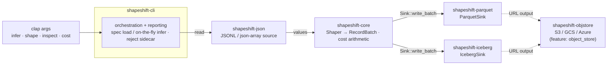
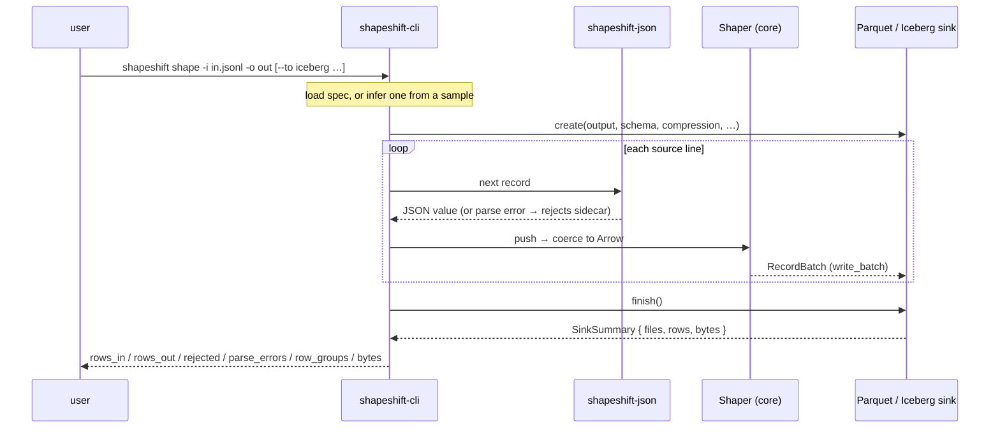

# shapeshift-cli — the `shapeshift` binary

`shapeshift-cli` is the thin command-line driver over the shapeshift engine: it wires
`shapeshift-json` (source) → `shapeshift-core` (`Shaper`) → `shapeshift-parquet` /
`shapeshift-iceberg` (`Sink`) into one single static binary. All the logic lives in the
library crates; this crate is argument parsing, orchestration, and reporting.

## Architecture

The binary is a thin orchestrator: `clap` parses the subcommand, then the source, the
`Shaper`, and the chosen `Sink` are wired through `shapeshift-core`'s `Sink` trait. Every
backend lives in a library crate, so the CLI never depends on Arrow/Parquet/Avro directly —
it just composes them.



## Commands

- **`shapeshift infer -i <input>`** — sample the input and print a ready-to-edit
  `DatasetSpec` (YAML), or write it with `-o`. Flags: `--format`, `--sample`,
  `--no-flatten`, `--dataset`.
- **`shapeshift shape`** — shape JSONL/JSON into Parquet or an Iceberg table. Run under a
  spec (`-s spec.yaml`) or infer on the fly (`-i input -o output`). `--to
  parquet|iceberg`, `--compression`, `--dataset`. `--append` (Iceberg only) commits a new
  snapshot onto an existing table instead of writing a fresh one. The schema may **add optional columns** (additive evolution — old rows read them as null); dropping, renaming, or re-typing columns is refused.
  `--partition-by <entries>` (Iceberg only) applies **identity and hidden (transform)
  partitioning**: each entry is a column (`region`) or a transform expression —
  `bucket(N, col)`, `truncate(W, col)`, `year|month|day|hour(col)`. Entries
  comma-separate (commas inside `(...)` don't split; the flag also repeats), e.g.
  `--partition-by 'day(event_at),region'`. Rows fan out to one data file per distinct
  combination of the *transformed* values, under nested Hive-style directories
  (temporal segments human-readable, e.g. `data/event_at_day=2026-01-01/region=us/`;
  composes with `--append`). Source parse errors are counted and
  sidecarred to `<output>.rejects.jsonl`; the run never aborts on a bad line. Prints
  `rows_in / rows_out / rejected / parse_errors / row_groups / bytes`.
  `--on-drift ignore|warn|rescue|quarantine|error` (overriding the spec's `drift.policy`,
  default `warn`) decides what happens when the source outgrows the schema — an undeclared
  field, or a value that stopped coercing in an optional column. Both used to pass silently;
  now they are counted, summarized on stdout (with the `columns:` block that would keep them),
  and written in full to `<output>.drift.json`. `rescue` keeps the dropped values in a `json`
  catch-all column named by `--rescue-column` (default `_rescued`); `quarantine` rejects the
  drifted rows into the reject sidecar; `error` fails the run.
  `--pipeline auto|on|off` (default `auto`, which is on) hands each finished row group to
  a writer thread, so encoding and compressing it overlaps with shaping the next instead
  of taking turns on one core — worth **+10% on musl and +22% on glibc**
  ([BENCHMARKS §7](../BENCHMARKS.md#7-performance-measured)). It never changes the output,
  only who waits; memory stays bounded by the row group, and the thread is only spawned
  once a second row group exists, so small runs and cold start are untouched. `off` is the
  escape hatch for a constrained box, or to measure what it is worth on your hardware.
- **`shapeshift inspect <path>`** — auto-detects a Parquet file or an Iceberg table dir
  and prints its schema + row/record count.
- **`shapeshift cost`** — price a run against a managed vendor's MAR rate:
  `--rows N | -i input`, `--vendor-per-million P`, `--self-host-cost C`. Never guesses a
  price; honest (negative when a job is too small to amortize).

## Event flow — `shape`

One `shape` run reads the source line by line, coerces each record through the `Shaper`,
and streams batches into the sink; a bad line is counted and sidecarred rather than
aborting the run.



## Quickstart

```sh
shapeshift shape --input events.jsonl --output events.parquet          # infer + shape
shapeshift shape --input events.jsonl --output events_tbl --to iceberg # Iceberg v2 table
shapeshift shape --input events.jsonl --output events_tbl --to iceberg --partition-by region  # identity-partitioned
shapeshift inspect events_tbl
shapeshift cost --rows 50000000 --vendor-per-million 600 --self-host-cost 2
```

## Build a static binary

```sh
rustup target add x86_64-unknown-linux-musl
cargo build --release --target x86_64-unknown-linux-musl -p shapeshift-cli
```

Snappy is the **default** and the only Parquet codec compiled in — the zstd/brotli
codecs are C and would break the musl-static build, so `--compression zstd` returns
a clear error (`--compression uncompressed` also works). That keeps the arrow/parquet
stack C-free, so the result is one relocatable musl-static binary — no JVM, no catalog
server, no Python.

### Optional zstd (the "fat build")

If you want zstd and don't need the musl-static lean binary, opt in with the `zstd`
feature — it links the zstd C codec and makes `--compression zstd` work for **both**
Parquet output and Iceberg data files:

```sh
cargo build --release -p shapeshift-cli --features zstd
shapeshift shape -i events.jsonl -o events.parquet --compression zstd
```

The default build's dependency graph contains no zstd at all — the fat build is a
separate, deliberate choice, not a flag on the lean binary.

## Object-store output (S3 / GCS / Azure)

A URL `--output` writes straight to a bucket — **both Parquet and a whole Iceberg v2
table** — when built with the **off-by-default `object_store` feature** (kept out of the
default binary above so it never links the cloud SDKs):

```sh
cargo build -p shapeshift-cli --features object_store
AWS_REGION=us-east-1 AWS_ACCESS_KEY_ID=… AWS_SECRET_ACCESS_KEY=… \
  shapeshift shape --input events.jsonl --output s3://my-bucket/events.parquet          # Parquet
AWS_REGION=us-east-1 AWS_ACCESS_KEY_ID=… AWS_SECRET_ACCESS_KEY=… \
  shapeshift shape --input events.jsonl --output s3://my-bucket/db/events --to iceberg   # Iceberg table
shapeshift inspect s3://my-bucket/db/events                                              # summarize it
```

`s3://` · `gs://` · `az://` · `file://` are supported (credentials from the standard
`AWS_*` / `GOOGLE_*` / `AZURE_*` env vars); data uploads as a bounded-RAM multipart
stream. The Iceberg table's paths are anchored at the destination, so DuckDB
`iceberg_scan('s3://…')` reads it in place. The default binary refuses a URL `--output`
(or `inspect <url>`) with a clear "rebuild with `--features object_store`" message. A
**REST catalog** (copy-anywhere relocation) is out of scope — use an external one. See
[`shapeshift-objstore`](../shapeshift-objstore).

See [`examples/embed.rs`](./examples/embed.rs) for driving the same engine as a library.
