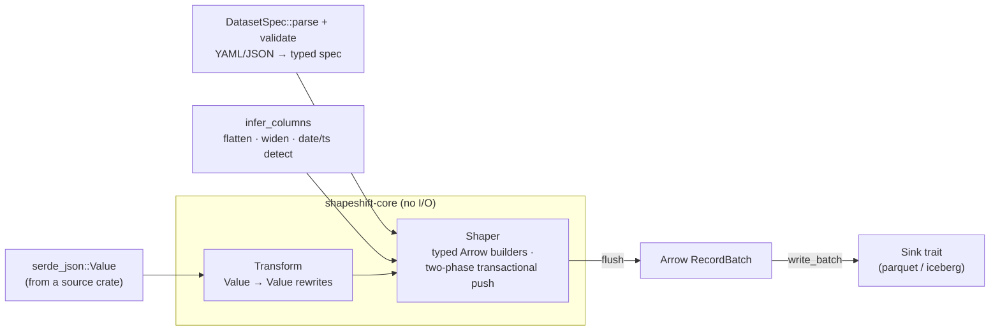
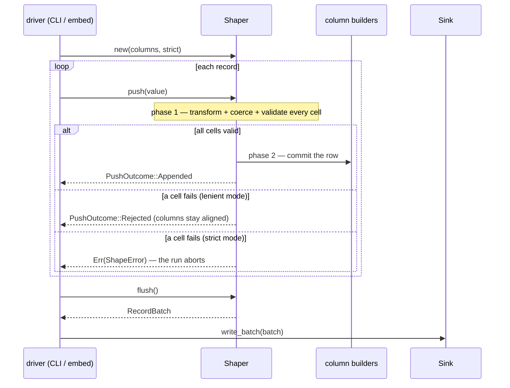

# shapeshift-core — the JSON→columnar shaping engine

`shapeshift-core` owns shapeshift's domain model and its shaping loop, and
**nothing that does source or sink I/O**. It turns a stream of `serde_json::Value`
records into Arrow `RecordBatch`es under a declarative *dataset transform spec*.
The concrete JSON reader and the Parquet / Iceberg writers live in sibling crates
and are driven **only** through the `Sink` trait and the plain `Value` record model
defined here — so no physical format ever leaks into the engine.

## Architecture

A validated spec (or an inferred one) configures a `Shaper` of typed Arrow builders;
records flow in as `Value`s, are rewritten by `Transform`s, coerced, and flushed as
`RecordBatch`es to whatever implements the `Sink` trait. No source or sink I/O lives here.



## What it does

- **The dataset transform spec** — `DatasetSpec` (and `SourceSpec` / `OutputSpec` /
  `ColumnSpec` / `Options`): the YAML/JSON product boundary. `DatasetSpec::parse`
  auto-detects YAML vs JSON and `validate`s it (non-empty dataset, no duplicate
  columns, strict-needs-columns, and — when columns are declared — partition columns
  must be among them; in `infer` mode the sink resolves them against the inferred schema).
- **Logical types** — `ColumnType` (`bool` · `int64` · `float64` · `string` ·
  `date` · `timestamp` · `json`) and their mapping to Arrow and Iceberg physical types.
- **Schema inference** — `infer_columns`: sample records, flatten nested objects into
  dotted columns, widen `int`+`float` → `float64` and mixed scalars → `string`, and
  detect `YYYY-MM-DD` → date / RFC3339 → timestamp.
- **The transform library** — `Transform`: pure `Value → Value` rewrites applied
  before coercion (`lowercase`, `uppercase`, `trim`, `json_encode`, `to_string`,
  `dollars_to_cents`, `abs`, `empty_to_null`).
- **The shaper** — `Shaper`: one typed Arrow builder per column, a **two-phase
  transactional `push`** (compute + validate every cell before committing any, so a
  rejected row never misaligns the columns), and `flush` → `RecordBatch`. `PushOutcome`
  reports `Appended` vs a lenient `Rejected`; `run_pipeline` drives a whole shape.
- **The sink seam** — the `Sink` trait (`write_batch` / `finish` → `SinkSummary`), the
  only surface the engine depends on for output.
- **MAR arithmetic** — `estimate_mar`, `MarInputs`, `MarReport`: the honest
  vendor-vs-self-host cost comparison (you supply the vendor's `$/million MAR`).
- `ShapeError` (the crate's error enum) and `Result`.

## Event flow — a shape loop

`push` is **two-phase and transactional**: it transforms, coerces, and validates every
cell of a row *before* committing any, so a rejected row never leaves the column builders
misaligned.



## Quickstart

```rust
use serde_json::json;
use shapeshift_core::{infer_columns, Shaper, PushOutcome};

let records = vec![json!({"id": 1, "user": {"name": "Ada"}, "amount": 12.5})];
let cols = infer_columns(records.iter(), /* flatten = */ true);
let mut shaper = Shaper::new(cols, /* strict = */ false)?;
for r in &records {
    assert_eq!(shaper.push(r)?, PushOutcome::Appended);
}
let batch = shaper.flush()?.unwrap();          // an Arrow RecordBatch, ready for any Sink
# Ok::<(), shapeshift_core::ShapeError>(())
```

`shapeshift-core` is a library; a source feeds it `Value`s and a `Sink`
(`shapeshift-parquet` / `shapeshift-iceberg`) consumes its batches.
