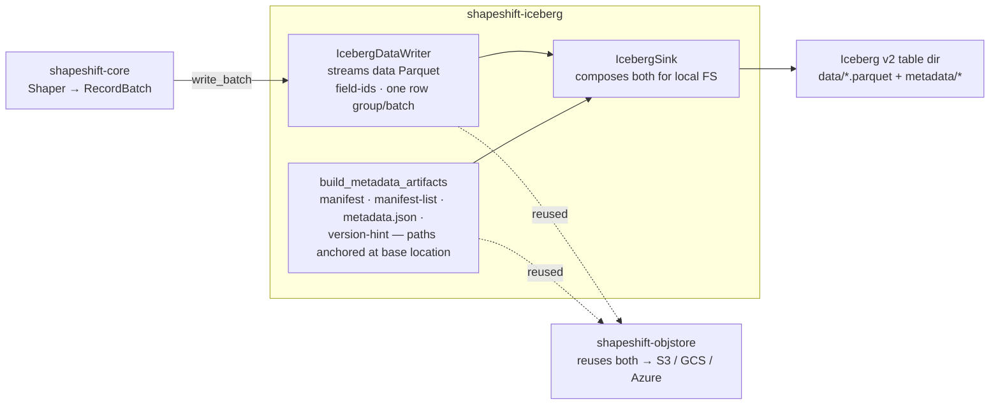
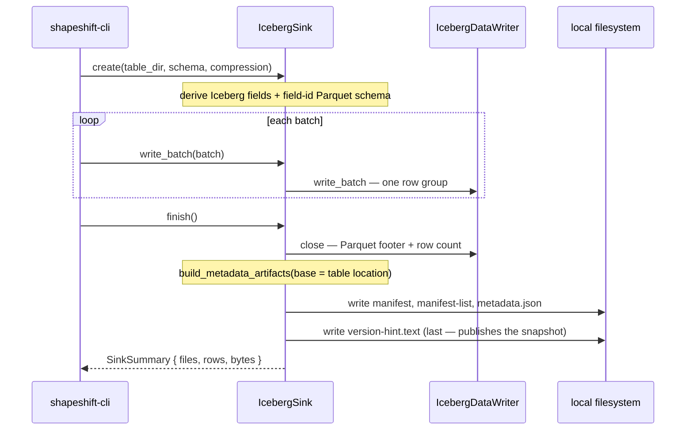

# shapeshift-iceberg — the Apache Iceberg v2 sink

`shapeshift-iceberg` is the lakehouse **output side** of the shapeshift stack: it
implements `shapeshift_core::Sink`, writing a **self-contained Apache Iceberg v2 table**
around the Parquet writer — no catalog server required. One shape produces one atomic
append snapshot.

## What it does

- **`IcebergSink`** — a write-once `Sink` that derives the Iceberg schema from the Arrow
  schema, then on `finish` emits the full v2 table:

  ```text
  <table>/
    data/<uuid>.parquet                 data file (Parquet, carrying PARQUET:field_id)
    metadata/<uuid>-m0.avro             manifest (lists data files)
    metadata/snap-<id>-1-<uuid>.avro    manifest list (lists manifests)
    metadata/v1.metadata.json           table metadata (v2)
    metadata/version-hint.text          → 1
  ```

- **The field-id chain** — the data file's Arrow schema is rewritten to carry
  `PARQUET:field_id` on every column, matching the Iceberg schema's ids `1..N`; that is
  what makes the Parquet genuinely Iceberg-readable rather than just Parquet-in-a-directory.
- **A hand-rolled Avro OCF writer** (`avro.rs`) — Iceberg readers map manifest columns by
  the `field-id` attributes embedded in the manifest's Avro schema, and the general Rust
  Avro crates *drop* those custom attributes when they serialize the schema (DuckDB then
  fails: *"No default expression in FieldId Map"*). Emitting the Object Container File
  ourselves preserves the exact field-id-carrying schema JSON — and drops a dependency.
- **`inspect`** — read a table's current `metadata.json` (via `version-hint.text`) and
  summarize format-version / table-uuid / snapshot-id / total-records / columns.
- **A backend-agnostic table builder** — `IcebergDataWriter` (streams the data Parquet)
  and `build_metadata_artifacts` (turns the field list + a **base location** into the
  manifest / manifest-list / metadata / version-hint **as bytes**, every path anchored at
  that location). `IcebergSink` composes them for the local filesystem;
  [`shapeshift-objstore`](../shapeshift-objstore) reuses the *same* two pieces to land a
  table in S3/GCS/Azure, so there is one Iceberg implementation, not two.

Verified end-to-end with DuckDB 1.5.4 `iceberg_scan()` — local **and** via a `file://`
object-store backend (the cloud backends share the same write path).

## Architecture

The crate splits into two reusable pieces plus a local composer, so the *same* table
logic serves both the local sink and the object-store sink — one Iceberg implementation,
not two. Every embedded path is `<base_location>/<key>`, so the table is valid wherever it
is written (a local dir or a bucket prefix).



## Event flow — `create` → `write_batch`\* → `finish`



## Quickstart

```rust
use shapeshift_core::{Compression, Sink};
use shapeshift_iceberg::{inspect, IcebergSink};

// `schema` and `batch` come from a shapeshift_core::Shaper.
// create(path, schema, compression, append, partition_by):
//   append = false → fresh table; partition_by = &[] → unpartitioned.
//   e.g. (.., true, &["region".into()]) appends a partitioned snapshot.
let mut sink = IcebergSink::create("./events_tbl", schema, Compression::Snappy, false, &[])?;
sink.write_batch(&batch)?;
let summary = sink.finish()?;         // writes data Parquet + manifests + v2 metadata
assert_eq!(inspect("./events_tbl")?.total_records as u64, summary.rows);
# Ok::<(), shapeshift_core::ShapeError>(())
```

From the CLI it is just a different `--to`:

```sh
shapeshift shape --input events.jsonl --output events_tbl --to iceberg
shapeshift inspect events_tbl          # format-version / snapshot-id / total-records / columns
```

## v0.1 scope

**Append-to-existing / multi-snapshot** is supported: `IcebergSink::create(.., append =
true)` (CLI `--append`) commits a new snapshot onto an existing table — it reads the prior
`metadata.json` + manifest list (via the crate's hand-rolled Avro reader), carries the
prior manifests forward, bumps the snapshot id + sequence, and writes `v{N+1}.metadata.json`.
Appends support **additive schema evolution**: new *optional* columns are welcomed —
existing columns keep their field-ids (matched by name), new columns get fresh ids after
the table's `last-column-id`, and the metadata gains a new schema object (`schemas` keeps
the old ones, so prior snapshots stay readable; readers fill the new column with null for
old rows). Anything non-additive — dropping, renaming, or re-typing a column, or a new
*required* column — is refused, and the partition spec must match exactly; incompatible
appends fail at `create()`, before any data file is written, so a rejected append never
leaves an orphan behind. Appends are **single-writer**: the sink reads
`version-hint.text`, computes the next version, and publishes it with no lock, so concurrent
writers to one table would clobber each other — a multi-writer catalog (relocatable, atomic
commits) is the roadmap REST catalog. Every data file records **per-column
statistics** (`value_counts` / `null_value_counts` + min/max `lower_bounds` /
`upper_bounds`, exact values in Iceberg's little-endian single-value encoding), so readers
skip files by predicate. **Partitioning** is applied — identity
(`IcebergSink::create(.., partition_by = &["region".into()])`, CLI `--partition-by region`)
**and hidden (transform) partitions**: `bucket(N, col)` (spec-exact Murmur3, verified
against the Iceberg spec's Appendix B vectors), `truncate(W, col)`, and temporal
`year|month|day|hour(col)`, expressed directly in the same `partition_by` entries
(`&["day(event_at)".into(), "region".into()]`, CLI `--partition-by 'day(event_at),region'`).
Rows fan out to one data file per **transformed** value under Hive-style directories
(nested per field; temporal segments human-readable, e.g.
`data/event_at_day=2026-01-01/region=us/`), each file's partition tuple recorded in the
manifest with the transform's *result* type, and the table metadata records the real
transform strings (`day`, `bucket[16]`, …); it composes with `--append` (the spec must
match exactly, transform included). A partitioned table needs **at least
one row** (a zero-row input has no partition to write and is refused).
Paths are **location-anchored** (absolute): a table reads
back at the location it was written to. It is also **relocatable for reading** — copy or move
the whole table directory anywhere and DuckDB reads it with
`iceberg_scan('<new path>', allow_moved_paths=true)` (verified for partitioned and
multi-snapshot tables; predicate pruning still works). What stays commercial-edition: **catalog-managed
relocation** — re-anchoring the embedded paths so *any* engine reads the moved table with no
special flag, plus multi-writer atomic commits (the roadmap REST catalog).

## Relocating a table (copy-anywhere)

The embedded paths are absolute, so a table moved to a new location fails a *default* reader.
Two ways to work with a moved/copied table today — no catalog, no rewrite:

```sh
# Copy the whole table directory somewhere new (any tool: cp -r, aws s3 cp --recursive, …).
cp -r ./events_tbl /mnt/archive/events_tbl

# `shapeshift inspect` reads a moved table directly — it follows the version-hint pointer and
# reads metadata.json, never the embedded data-file paths.
shapeshift inspect /mnt/archive/events_tbl
```

```sql
-- DuckDB resolves the moved data/manifest paths relative to the new location:
SELECT * FROM iceberg_scan('/mnt/archive/events_tbl', allow_moved_paths = true);
```

For a table that *any* engine reads after a move with no reader flag — paths re-anchored on
commit, plus multi-writer atomic commits — you want a catalog: the hosted **REST catalog** is
the commercial-edition story.
