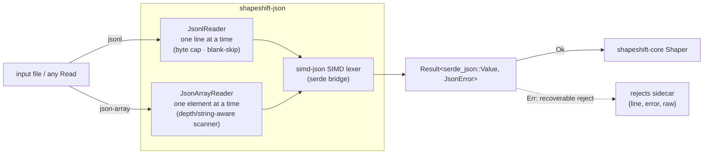
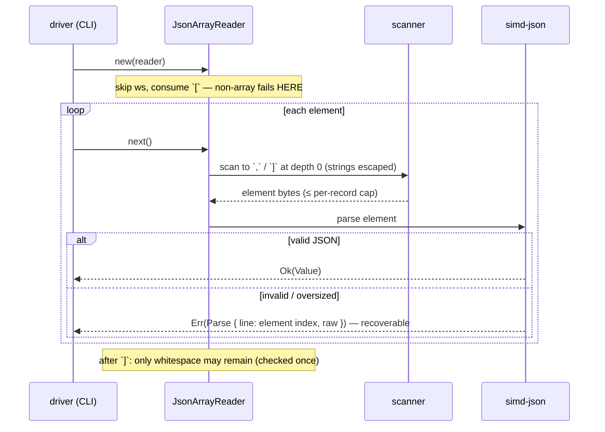

# shapeshift-json — the streaming JSON source

`shapeshift-json` is the **input side** of the shapeshift stack: bounded-RAM readers
that yield `serde_json::Value` records for `shapeshift-core`'s `Shaper`. It drives the
[simd-json](https://docs.rs/simd-json) SIMD lexer through its serde bridge, landing
straight in the ubiquitous `serde_json::Value` so everything downstream stays on one
value model.

## Architecture

Two readers, one contract: each yields `Result<Value, JsonError>` records with bounded
RAM, so the engine never knows (or cares) whether the input was line-delimited or one
big array.



## Event flow — streaming a json-array

The array scanner tracks nesting depth and string state to find each element's
boundary; only that element's bytes are ever buffered.



## What it does

- **`JsonlReader`** — the streaming path: one JSON object per line. A single line
  enters memory at a time, so a 100M-line file never materializes. Blank / whitespace-
  only lines are skipped (not errors).
- **`JsonArrayReader`** — a single top-level JSON array, **streamed**: arrays are not
  line-delimited, so a small depth- and string-aware scanner finds each element's
  boundary (`{`/`[` nest; strings may contain `,`/`]`/escapes) and buffers **one
  element at a time** under the same per-record byte cap — a multi-GB array never
  materializes. That the input is an array at all is checked eagerly at open.
- **Bad records preserved** — a parse failure yields `JsonError::Parse { line, message,
  raw }` with the offending text kept (in array mode `line` is the 1-based element
  index), so the CLI can sidecar it to `<output>.rejects.jsonl` for repair and
  re-ingest — the reader recovers and continues. Structural array problems (truncated
  array, trailing comma/garbage) are reported once, then iteration ends.
- **`open_reader`** — a boxed `RecordSource` for a path in the requested
  `shapeshift_core::SourceFormat` (both formats stream).

## Quickstart

```rust
use std::io::Cursor;
use shapeshift_json::JsonlReader;

let data = "{\"id\":1}\n\n{\"id\":2}\n";        // the blank line is skipped
let rows: Vec<_> = JsonlReader::new(Cursor::new(data))
    .collect::<Result<_, _>>()
    .unwrap();
assert_eq!(rows.len(), 2);
assert_eq!(rows[0]["id"], 1);
```
