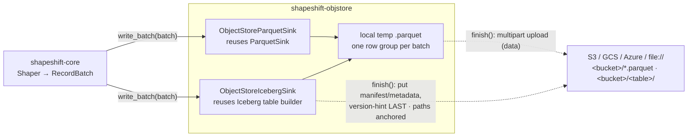
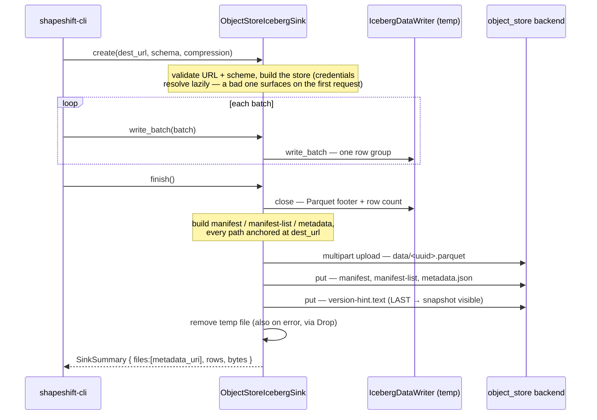

# shapeshift-objstore — the object-store sink

`shapeshift-objstore` lands shapeshift's output in an **object store** — **S3 / GCS /
Azure**, or `file://` — instead of the local filesystem, for **both** sink formats. Each
implements `shapeshift_core::Sink`, so the shaping engine is unchanged; only the
destination moves. This is the first hosting primitive: whatever the commercial control plane
writes to a bucket flows through here.

## What it does

- **`ObjectStoreParquetSink`** — a write-once `Sink` targeting an `s3://` / `gs://` /
  `az://` / `file://` URL. It writes the Parquet to a local temp file first (one row
  group per batch, exactly like [`shapeshift-parquet`](../shapeshift-parquet)), then on
  `finish` streams it to the store as a **multipart upload** in fixed 8 MiB parts — so
  neither the shape nor the upload ever holds the whole object in RAM.
- **`ObjectStoreIcebergSink`** — a write-once `Sink` that lands a whole self-contained
  **Iceberg v2 table** (data Parquet + manifest + manifest-list + `metadata.json` +
  `version-hint.text`) under a URL prefix. It reuses
  [`shapeshift-iceberg`](../shapeshift-iceberg)'s backend-agnostic table builder: the data
  Parquet streams up as a multipart upload, the metadata blobs go via `put`, and
  `version-hint.text` is written **last** so the snapshot only becomes visible once every
  file it references is in place. Every embedded path is **anchored at the destination
  URI**, so DuckDB `iceberg_scan('s3://…')` reads the table back in place.
- **`inspect_iceberg`** — read an object-store table's current metadata (via
  `version-hint.text`) and summarize it: the remote analog of
  `shapeshift_iceberg::inspect`.
- **`is_object_url`** — the scheme check the CLI uses to route a URL `--output` here.
- **Credentials** come from the standard `AWS_*` / `GOOGLE_*` / `AZURE_*` environment
  variables (the `object_store` builders' `from_env()`); nothing is logged or stored.

## Architecture

Both sinks reuse the *local* writers and add a remote-landing tail — the engine never
changes, only the destination. Parquet is one object; an Iceberg table is five objects
whose cross-references are anchored at the destination location, so the table is valid at
its bucket prefix (a server-less Hadoop-style catalog layout).



## Event flow — `create` → `write_batch`\* → `finish` (Iceberg)

The Parquet flow is the same up to `finish`, where it uploads a single object. The Iceberg
sink uploads the data file, then `put`s the metadata, publishing `version-hint.text` last:



## Quickstart

Route output to a bucket instead of a local path — the shaping code is identical, only
the destination URL and sink type change:

```rust
use shapeshift_core::{Compression, Sink};
use shapeshift_objstore::{is_object_url, ObjectStoreIcebergSink, ObjectStoreParquetSink};

// `schema` and `batch` come from a shapeshift_core::Shaper.
assert!(is_object_url("s3://my-bucket/events.parquet"));

// A single Parquet object:
let mut pq = ObjectStoreParquetSink::create(
    "s3://my-bucket/events.parquet",
    schema.clone(),
    Compression::Snappy,
)?;
pq.write_batch(&batch)?;
let s = pq.finish()?; // streams the temp Parquet up as a multipart upload
println!("landed {} rows", s.rows);

// …or a whole Iceberg v2 table under a prefix (readable via iceberg_scan('s3://…')):
let mut ice = ObjectStoreIcebergSink::create(
    "s3://my-bucket/db/events",
    schema,
    Compression::Snappy,
)?;
ice.write_batch(&batch)?;
ice.finish()?; // uploads data + manifests + metadata, version-hint last
# Ok::<(), shapeshift_core::ShapeError>(())
```

From the CLI it is a URL `--output` on a build with the `object_store` feature:

```sh
cargo build -p shapeshift-cli --features object_store
AWS_REGION=us-east-1 AWS_ACCESS_KEY_ID=… AWS_SECRET_ACCESS_KEY=… \
  shapeshift shape --input events.jsonl --output s3://my-bucket/db/events --to iceberg
shapeshift inspect s3://my-bucket/db/events   # summarize the table in the bucket
```

## Why a separate crate (and off by default)

`object_store` pulls the cloud SDKs (reqwest, TLS, provider clients) — not
musl-static-clean and not wanted in the lean default `shapeshift` binary. The CLI
depends on this crate **only behind an off-by-default `object_store` feature**, so the
default build never links any of it (CI asserts its absence). The async `object_store`
API is bridged to shapeshift's sync `Sink` on a small current-thread runtime, at
finalize time only.

## v0.1 scope

Both **Parquet** and **Iceberg v2** land in an object store, verified end-to-end with
DuckDB `iceberg_scan('file://…')` (identical to the local path). Tables are
**location-anchored** (absolute paths) — valid and readable at the prefix they were written
to, and still **readable after a move/copy** via `iceberg_scan('<new path>',
allow_moved_paths=true)`. **Catalog-managed** relocation (re-anchoring paths so any engine
reads a moved table with no flag, plus multi-writer commits) is the commercial-edition REST catalog.
