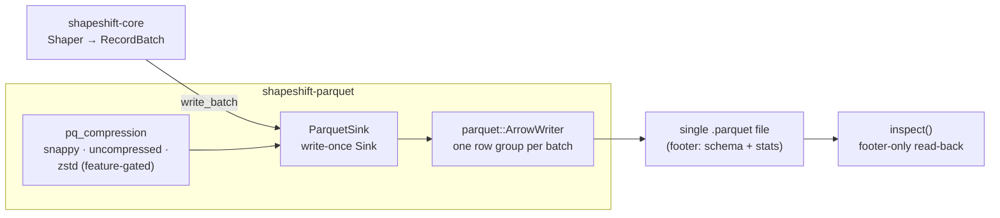
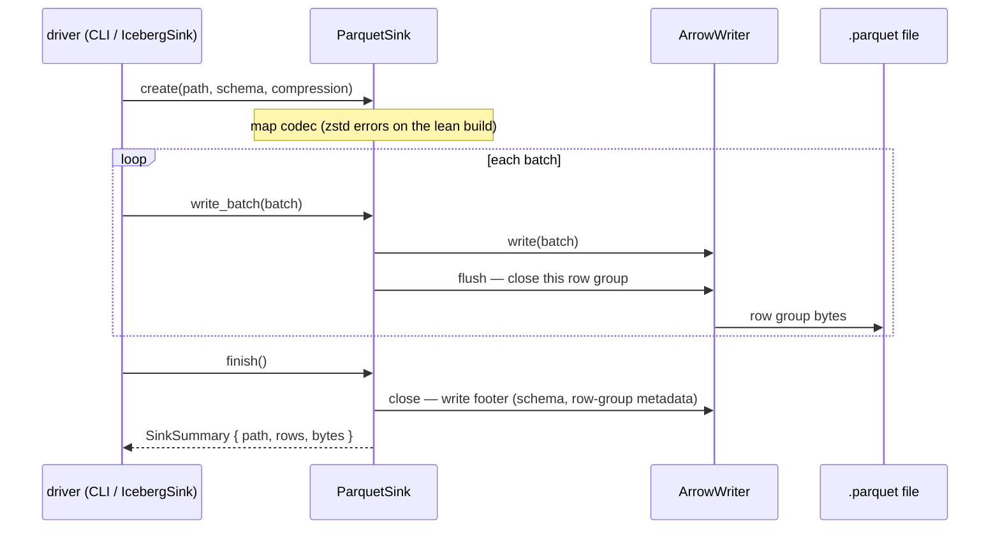

# shapeshift-parquet — the Parquet sink

`shapeshift-parquet` is one **output side** of the shapeshift stack: it implements
`shapeshift_core::Sink`, streaming Arrow `RecordBatch`es to a single Parquet file via
`parquet::arrow::ArrowWriter`. It flushes **one row group per batch**, so a 100M-row
shape never holds more than one row group in RAM.

## Architecture

The crate is a thin, write-once `Sink` over `ArrowWriter`: batches in, row groups out,
footer on `finish`. The compression mapping is where the build flavor shows — Snappy
always, zstd only in the opt-in fat build.



## Event flow — `create` → `write_batch`\* → `finish`

Each `write_batch` closes its row group immediately — the flush is what bounds RAM and
makes progress durable at the same boundary.



## What it does

- **`ParquetSink`** — a write-once `Sink` over a fixed Arrow schema. `create` opens the
  file (making parent dirs); `write_batch` writes + flushes a row group; `finish`
  closes the footer and returns a `SinkSummary` (path, rows, bytes).
- **musl-static, C-free by default** — the `parquet` dependency is built with
  `default-features = false, features = ["arrow", "snap"]`, so Snappy is the codec and
  the zstd/brotli C codecs are not linked. `Compression::Zstd` returns a clear error
  rather than a silent surprise (use `snappy` or `uncompressed`) — unless the crate is
  built with the opt-in **`zstd` feature** (the "fat build"), which links the codec and
  makes `Compression::Zstd` work.
- **`inspect`** — read a Parquet file's schema + row / row-group counts from its footer
  (no data scan). Used by `shapeshift inspect` and as a self-contained round-trip check.

## Quickstart

```rust
use shapeshift_core::{Compression, Sink};
use shapeshift_parquet::{ParquetSink, inspect};

// `schema` and `batch` come from a shapeshift_core::Shaper.
let mut sink = ParquetSink::create("out.parquet", schema, Compression::Snappy)?;
sink.write_batch(&batch)?;
let summary = sink.finish()?;                 // closes the footer
assert_eq!(inspect("out.parquet")?.rows as u64, summary.rows);
# Ok::<(), shapeshift_core::ShapeError>(())
```
