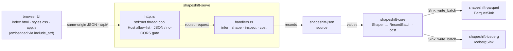
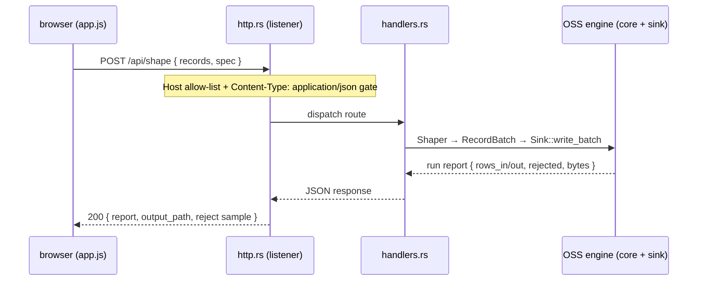

# shapeshift-serve

A tiny **local web console** for the shapeshift shaper. `shapeshift serve` starts an
HTTP server that puts a browser UI in front of the same four verbs the CLI exposes —
**infer** a spec from sample JSON, **shape** JSON/JSONL into Parquet or an Apache
Iceberg v2 table, **inspect** the output, and **cost** a run against MAR billing.

It is deliberately lean: a
*shaper* console, not a control plane. Single-user, stateless beyond the files it
writes, with **no scheduler, run queue, catalog server, connectors, metering, or
auth**. Those are orchestration concerns, and out of scope here.

## Single static binary, no runtime

In keeping with shapeshift's ethos (a musl-static single binary, the hand-rolled
Avro encoder), this crate adds **no runtime dependency**:

- The HTTP server is **hand-rolled on `std::net`** — a fixed pool of threads over a
  shared listener. No async runtime (no tokio), no web framework (no axum), no TLS.
- The UI is **three static files** (`ui/index.html`, `ui/styles.css`, `ui/app.js`)
  **embedded into the binary** at compile time with `include_str!`. No Node, no
  bundler, no CDN — the page fetches nothing off-box (enforced by a strict CSP).

So `shapeshift serve` is still one relocatable file with no JVM/Node/Python at
runtime, and the console is compiled *out* of the default build entirely — it lives
behind the CLI's off-by-default `serve` feature.

## Architecture

`shapeshift serve` is a thin HTTP shell over the same OSS engine the CLI drives. The
hand-rolled `std::net` server (`http.rs`) accepts a connection on a fixed thread pool,
applies the `Host` allow-list and the JSON / no-CORS gate, then hands the request to a
route in `handlers.rs`; each route wraps one engine verb one-to-one. The browser UI is
three static files embedded into the binary, so the page fetches nothing off-box.



## Event flow — a `shape` request

Submitting the form POSTs the pasted records plus the edited `DatasetSpec` to
`/api/shape`. The server gates the request, runs it through the engine exactly as the
CLI's `shape` verb would, and returns the run report the UI renders.



## Quickstart

```sh
# Build the CLI with the console compiled in, then start it.
cargo build --release -p shapeshift-cli --features serve
shapeshift serve                       # → http://127.0.0.1:8087/
shapeshift serve --addr 0.0.0.0:8087 --data-dir /var/lib/shapeshift
```

| Flag | Default | Meaning |
|---|---|---|
| `--addr` | `127.0.0.1:8087` | Address to bind. |
| `--data-dir` | `shapeshift-data` | Where shaped output, reject sidecars, and temp input land. |
| `--allow-host <h>` | — | Extra `Host` header to accept (repeatable), for a hostname behind a proxy. |
| `--allow-any-host` | off | Disable the `Host` allow-list (only behind a trusted proxy). |

## Security

This is a **local tool with no application-level authentication** — keep it bound to
loopback, or front it with your own auth/proxy if you expose it. Two lightweight
gates guard the browser attack surface:

- **`Host`-header allow-list** (loopback names + the bind IP by default) — a
  DNS-rebinding guard: a page on another origin that rebinds to the server's IP still
  carries its own `Host` and is rejected (`403`).
- **`Content-Type: application/json` required on POST**, and **no CORS headers are
  ever sent** — so a cross-origin page cannot forge a state-changing request (it would
  need a CORS preflight the server never approves).

## API

Same-origin JSON, wrapping the OSS engine one-to-one:

| Method + path | Does |
|---|---|
| `GET /api/health` | liveness + version + data dir |
| `POST /api/infer` | sample records → an editable `DatasetSpec` (YAML) |
| `POST /api/shape` | records + spec → run report, output path, reject sample, drift report (`on_drift` picks the policy) |
| `POST /api/inspect` | a path → Parquet / Iceberg schema + row count |
| `POST /api/cost` | rows + prices → the MAR vendor-vs-self-host comparison |

## License

Apache-2.0 — part of the OSS shaper. Copyright © 2026 Nicholas Lu Chee Seng and the
shapeshift contributors.
